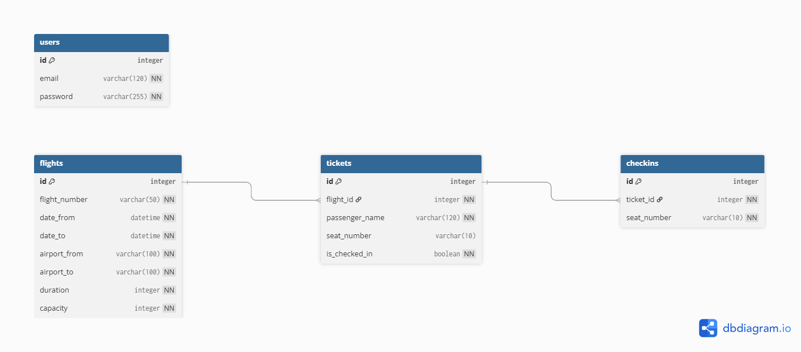
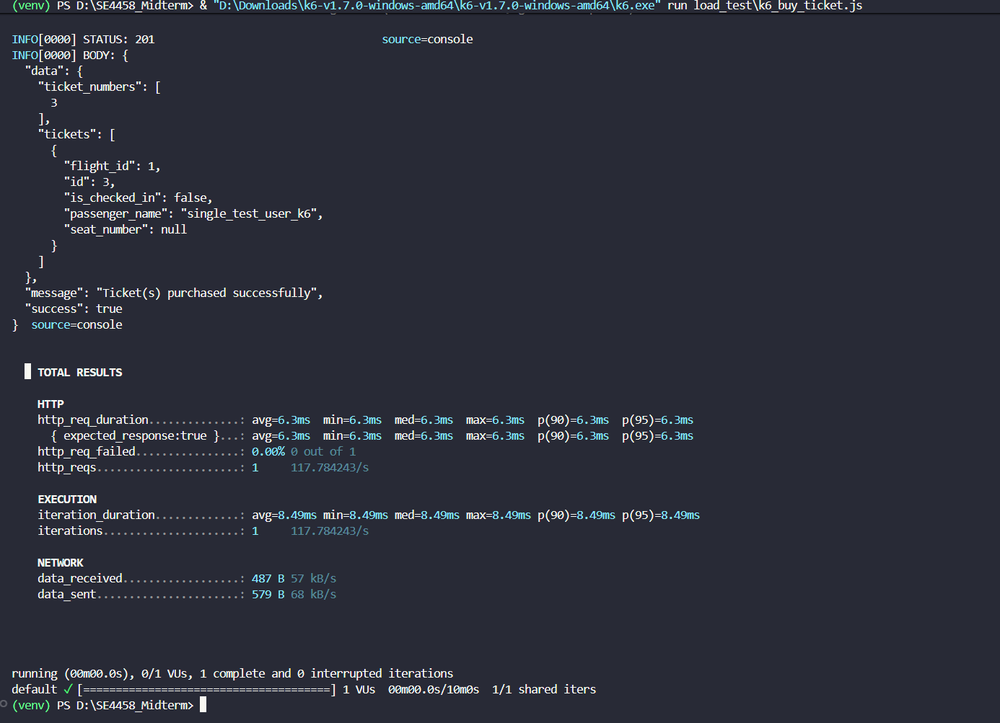
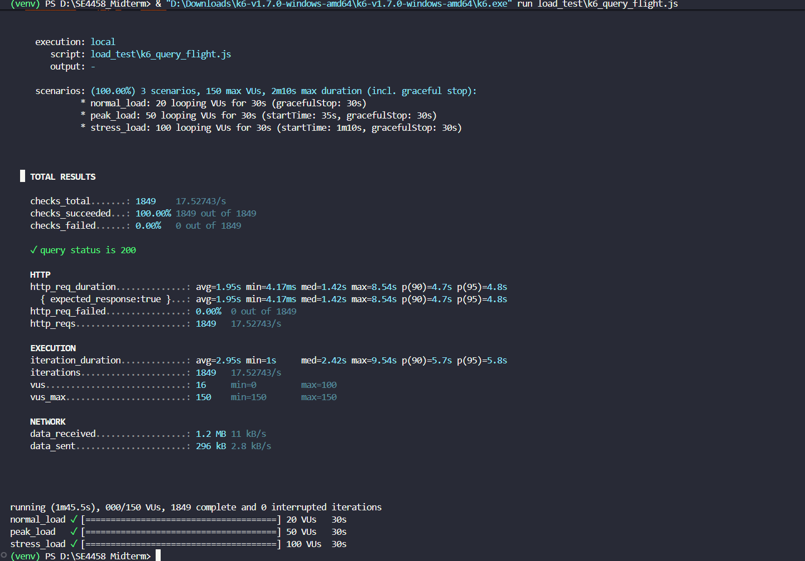

# Airline Ticketing API

## Overview

This project is a RESTful API for an airline ticketing system. It allows users to manage flights, search for available flights, purchase tickets, and perform check-in operations. The system is built using Flask, SQLAlchemy, JWT Authentication, Swagger documentation, and includes k6 load testing.

---

## Features

- User registration and authentication (JWT)
- Add flights manually or via CSV file
- Query available flights
- Buy tickets (with capacity control)
- Check-in passengers and assign seats
- View passenger list per flight
- Rate limiting (for flight queries)
- Load testing with k6

---

## Tech Stack

- Python (Flask)
- Flask-SQLAlchemy
- Flask-Migrate
- Flask-JWT-Extended
- SQLite
- Swagger (Flasgger)
- k6 (Load Testing)

---

## Setup Instructions

1. Clone the repository
   git clone <your-repo-link>
   cd airline_ticketing_api

2. Create virtual environment
   python -m venv venv

3. Activate virtual environment

Git Bash:
source venv/Scripts/activate

4. Install dependencies
   pip install -r requirements.txt

5. Set environment variable

Git Bash:
export FLASK_APP=app.py

6. Run database migrations
   flask db upgrade

7. Run the application
   python app.py

---

## API Documentation

Swagger UI:
http://127.0.0.1:5000/apidocs/

---

## Authentication

Register: /auth/register  
Login: /auth/login

Use token as:
Authorization: Bearer <token>

---

## Data Model (ER Diagram)

The system consists of four main entities: **User**, **Flight**, **Ticket**, and **CheckIn**.

### Entities

- User  
  Stores authentication information such as email and password.

- Flight  
  Represents a flight with details such as flight number, dates, airports, duration, and capacity.

- Ticket  
  Represents a passenger booking for a specific flight.

- CheckIn  
  Represents seat assignment for a ticket.

---

### Relationships

- One Flight can have many Tickets
- Each Ticket belongs to one Flight
- Each Ticket can have at most one CheckIn
- Each CheckIn belongs to one Ticket

---

### Notes

- The `tickets` field in the Flight model is a relationship, not a database column.
- `available_seats` is not stored in the database and is calculated dynamically:

available_seats = capacity - number_of_tickets

### Image of the Diagram

## 

# Load Testing Report – Airline Ticketing API

## Overview

This report presents the load testing results of the Airline Ticketing API. The tests were conducted using **k6** to evaluate the system’s performance under different levels of concurrent user load.

---

## Tested Endpoints

### 1. Buy Ticket

- **Endpoint:** `/tickets/buy`
- **Method:** POST
- **Description:**  
  This endpoint allows users to purchase tickets for a specific flight. Each successful request decreases the available capacity and generates ticket records.

---

### 2. Query Flight

- **Endpoint:** `/flights/query`
- **Method:** GET
- **Description:**  
   This endpoint retrieves available flights based on filters such as departure airport, destination airport, and number of passengers.

  **Important Note:**  
  A rate limiter (maximum 3 requests per day) was originally implemented for this endpoint.  
  For load testing purposes, this limiter was **temporarily disabled** to allow continuous request generation.

---

## Load Test Configuration

All tests were executed using **k6** with the following scenarios:

| Scenario    | Virtual Users (VUs) | Duration   |
| ----------- | ------------------- | ---------- |
| Normal Load | 20                  | 30 seconds |
| Peak Load   | 50                  | 30 seconds |
| Stress Load | 100                 | 30 seconds |

Each scenario was executed sequentially within the same test script.

---

## Performance Results

### Buy Ticket Endpoint

| Metric                | Result     |
| --------------------- | ---------- |
| Average Response Time | 6.3 ms     |
| 95th Percentile (p95) | 6.3 ms     |
| Requests per Second   | ~117 req/s |
| Error Rate            | 0%         |

---

### Query Flight Endpoint

| Metric                | Result      |
| --------------------- | ----------- |
| Average Response Time | 1.95 s      |
| 95th Percentile (p95) | 4.8 s       |
| Requests per Second   | ~17.5 req/s |
| Error Rate            | 0%          |

---

## Screenshots




---

## Analysis

The API demonstrated stable behavior under all load scenarios, with **zero failed requests** observed during testing.

The **Buy Ticket endpoint** performed exceptionally well, maintaining very low response times even under stress conditions. This indicates that the system handles write operations efficiently and scales well for ticket purchasing.

In contrast, the **Query Flight endpoint** showed noticeably higher response times, particularly in the 95th percentile (p95 ≈ 4.8 seconds). This suggests that read operations involving filtering or database queries may become a bottleneck under high load.

To improve performance and scalability, the following optimizations are recommended:

- Adding database indexes for frequently queried fields
- Optimizing query logic
- Implementing caching for frequently requested flight data

---

## Test Scripts

### Buy Ticket Load Test

```powershell
& "D:\Downloads\k6-v1.7.0-windows-amd64\k6-v1.7.0-windows-amd64\k6.exe" run load_test\k6_buy_ticket.js
```

### Query Flight Load Test

```powershell
& "D:\Downloads\k6-v1.7.0-windows-amd64\k6-v1.7.0-windows-amd64\k6.exe" run load_test\k6_query_flight.js
```

---

## Design Decisions

- RESTful architecture was used for clear endpoint structure
- JWT authentication was chosen for secure access control
- Separation of concerns applied (routes, models, services)
- SQLite was used for simplicity and easy setup
- Swagger was integrated for easy API testing and documentation

---

## Assumptions

- Each flight has a fixed capacity
- One passenger corresponds to one ticket
- Each ticket can only be checked in once
- Seat numbers are assigned sequentially
- Flights are uniquely identified by flight number and date

---

## Issues Encountered

- k6 was not initially recognized in the system PATH (resolved by running via executable path)
- Encoding issues occurred during request testing
- Rate limiting blocked load testing (temporarily disabled)
- Handling concurrent requests required unique passenger names
- Some request formatting mismatches between Swagger and k6

---

## Project Structure

airline_ticketing_api/
│
├── app/
│ ├── models/
│ ├── routes/
│ ├── services/
│ ├── schemas/
│ ├── utils/
│ └── docs/
│
├── load_test/
├── tests/
├── instance/
├── app.py
├── config.py
├── requirements.txt
└── README.md

---

## Testing

pytest

---

## Notes

- SQLite is used for simplicity
- Rate limiting exists but was disabled for load testing
- k6 was used for performance testing
